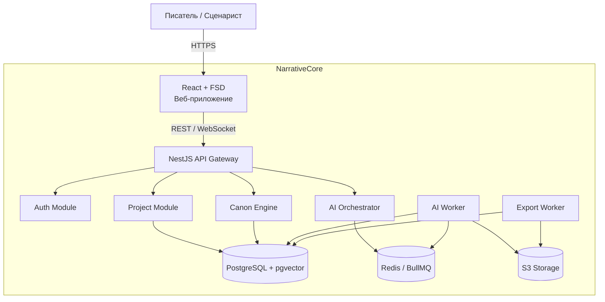
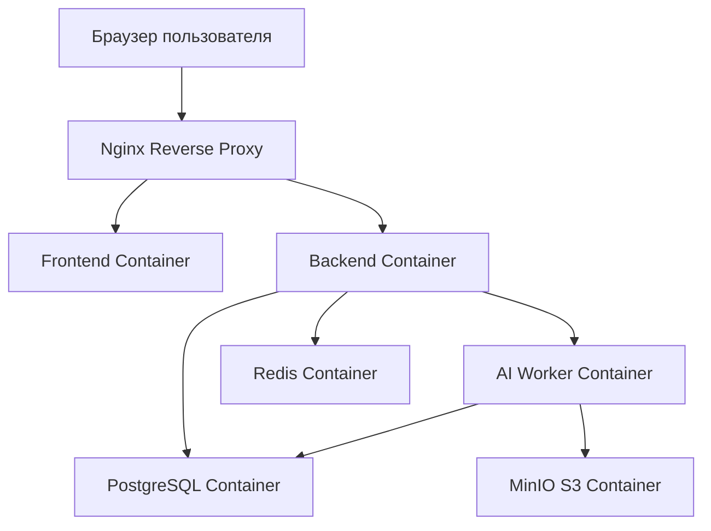
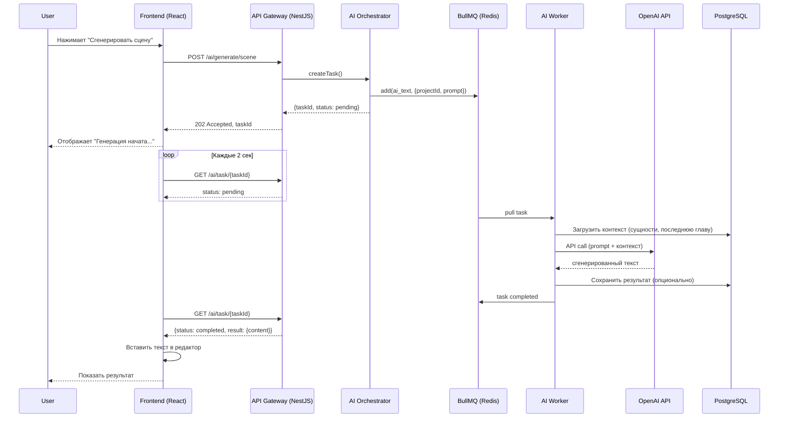
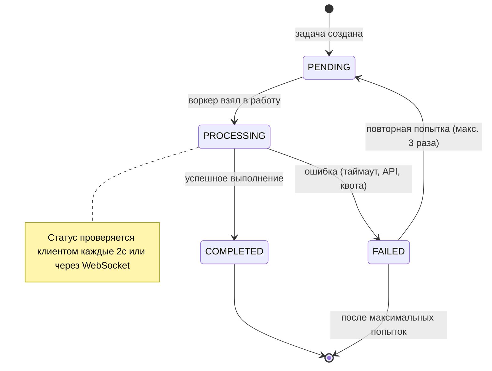
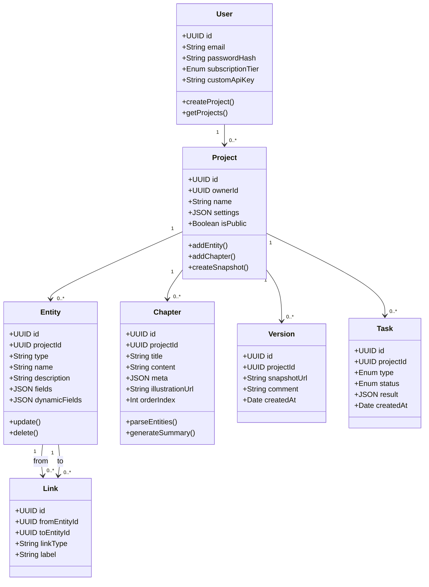
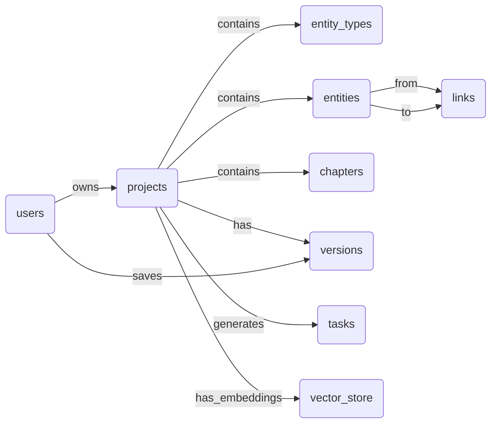
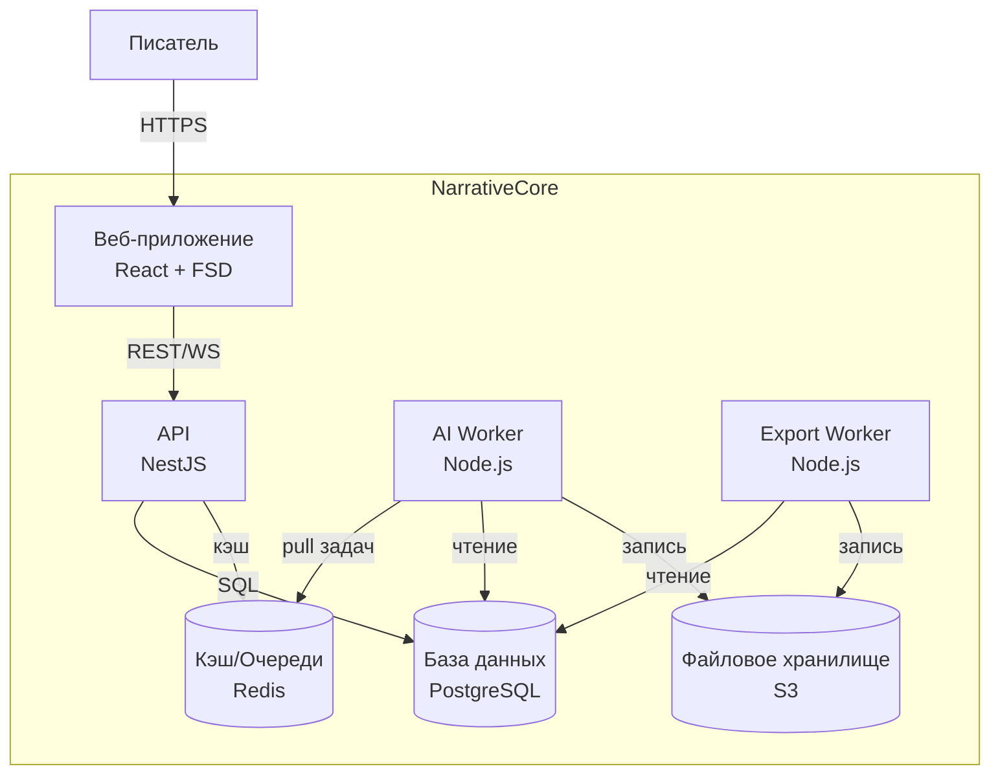
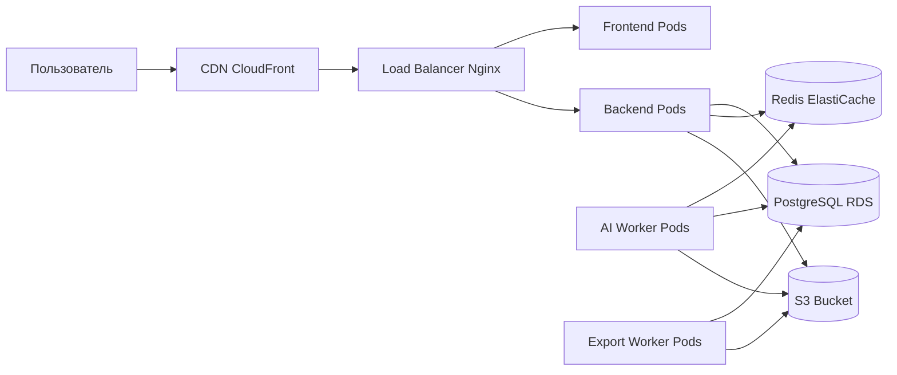

# ДИАГРАММЫ ПРОЕКТА – NARRATIVECORE (ТОЛЬКО MERMAID)

Все диаграммы переписаны в формате Mermaid, который гарантированно отображается в вашем окружении. Полный набор: компоненты, развёртывание, последовательность, классы, состояния, C4, ER, активность, инфраструктура.

---

## 1. ДИАГРАММА КОМПОНЕНТОВ



---

## 2. ДИАГРАММА РАЗВЁРТЫВАНИЯ (DEPLOYMENT)



---

## 3. ДИАГРАММА ПОСЛЕДОВАТЕЛЬНОСТИ (ГЕНЕРАЦИЯ СЦЕНЫ, MVP)



---

## 4. ДИАГРАММА СОСТОЯНИЙ (AI-ЗАДАЧА)



---

## 5. ДИАГРАММА КЛАССОВ (УПРОЩЁННО – ОСНОВНЫЕ СУЩНОСТИ)



---

## 6. ER-ДИАГРАММА БАЗЫ ДАННЫХ (ПОЛНАЯ)



---

## 7. C4 КОНТЕЙНЕРНАЯ ДИАГРАММА (УРОВЕНЬ 2)



---

## 8. ДИАГРАММА АКТИВНОСТИ (СОЗДАНИЕ СУЩНОСТИ ИЗ ТЕКСТА)

```mermaid
flowchart TD
    Start([Пользователь выделяет текст]) --> A[Нажимает "Создать сущность"]
    A --> B{Выделенный текст содержит имя?}
    B -->|Да| C[Подставить имя в поле name]
    B -->|Нет| D[Запросить ввод имени в модальном окне]
    C --> E[Выбор типа сущности]
    D --> E
    E --> F[Заполнение обязательных полей]
    F --> G[Нажатие "Сохранить"]
    G --> H[Фронтенд → POST /entities]
    H --> I[Бэкенд валидирует данные]
    I --> J[Сохраняет в БД]
    J --> K[Закрыть модальное окно]
    K --> L[Обновить контекстную панель]
    L --> M[Обновить граф (если открыт)]
    M --> Stop([Готово])
```

---

## 9. ДИАГРАММА ВЗАИМОДЕЙСТВИЯ С ИНФРАСТРУКТУРОЙ (OPS)



---

Все диаграммы теперь в формате Mermaid. Скопируйте их в любой поддерживающий Mermaid инструмент (GitHub Markdown, Obsidian, Mermaid Live, Notion и др.) – они отобразятся корректно.

*Конец документа «Диаграммы проекта (Mermaid)»*